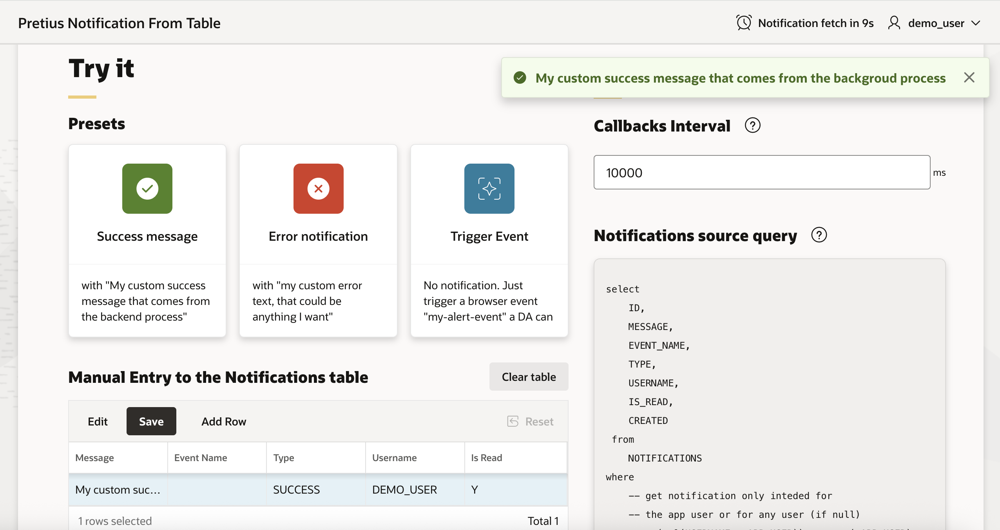

# Pretius Notifications From Table

Pretius Notifications From Table plugin can be used to fetch notifications from a database table with a given interval. Fetched notifications can be displayed as native APEX error or success messages.

## Table of Contents
- [Information about plugin](#information-about-plugin)
- [Preview](#preview)
- [License](#license)
- [Features at glance](#features-at-glance)
- [Roadmap](#roadmap)
- [Installation](#installation)
  - [Installation procedure](#installation-procedure)
- [Usage guide & Demo application](#usage-guide-demo-application)
- [Free support](#free-support)
  - [Bug reporting and change requests](#bug-reporting-and-change-requests)
  - [Implementation issues](#implementation-issues)
- [Become a contributor](#become-a-contributor)
- [Comercial support](#comercial-support)
- [Changelog](#changelog)
- [Known issues](#known-issues)
- [About Author](#about-author)
- [About Pretius](#about-pretius)

## Information about plugin

### Easy set up
Create a Dynamic Action on a Page Load of Page 0 in your application. Provide an SQL query to fetch data from your existing database table, next supply a proper column mapping. Configure fetching interval. The plugin will start monitor your table for any new notifications to display.

### Additional features
Silent notifications - plugin can trigger an event in addition or instead of displaying a visual notificiation. Events can be used to create other Dynamic Actions and implement some further application logic. Execute PL/SQL code after notification display - provide PL/SQL code to for e.g. delete or mark notification as read.

## Preview

## License

MIT

## Features at glance
* compatible with Oracle APEX 24.2+
* display query based APEX notifications 
* process displayed notifications as you wish
* trigger an event when a notification appears

## Roadmap
* [ ] Attribute for the event triggering element

## Installation

### Installation procedure
Using Oracle APEX plugin wizard install the plugin file plugin_install.sql

## Usage guide & Demo application
1. Create a new Dynamic Action on Page Load
1. Create a new True Action that is a Pretius Notifications From Table plugin instance.
1. Configure the plugin

### Callbacks Interval
Define how often the plugin fetches new notifications. Value is in milliseconds.

### Notifications source query
A SQL query used to fetch new notifications. It should contain at least three columns that stands for:

Primary key of the notifications source
Type of the notification
Notification message
Optional columns that the query can contain:

Event name - values of that column are the event names that are going to be triggered when the notification is fetched
Created date - a date and time when the notification was inserted to a table. It can be used to skip notifications that are older then the time a user entered the page.
Any column names are allowed. The mapping between a column and its purpose is defined in a Column Mapping section.

### Settings
Available options include:

**Display only new notifications**

Select this option to ignore any notifications from the source that were inserted before the time the plugin was initialised on a page. This option requires defining created date column in the source query and a column mapping.

**Execute PL/SQL Code after notification display**

Provide a PL/SQL code that is going to be executed after the notification is displayed. The code is executed with a delay equal to Callbacks Interval. This can be used to delete or mark the notifications as read.

**Trigger Event when displaying notificaiton**

Select this option to trigger a browser event when the notification is displayed. Event is triggered on a body element.

### Execute PL/SQL Code
Provide a PL/SQL code that is going to be executed after the notification is displayed. The code is executed with a delay equal to Callbacks Interval. This can be used to delete or mark the notifications as read.

Use a bind variable :NOTIFICATION_ID in the code to refer to the notification.

### [Demo application](https://bit.ly/4j5C7m9)

## Free support
Pretius provides free support for the plugins at the GitHub platform. 
We monitor raised issues, prepare fixes, and answer your questions. However, please note that we deliver the plug-ins free of charge, and therefore we will not always be able to help you immediately. 

Interested in better support? 
* [Become a contributor!](#become-a-contributor) We always prioritize the issues raised by our contributors and fix them for free.
* [Consider comercial support.](#comercial-support) Options and benefits are described in the chapter below.

### Bug reporting and change requests
Have you found a bug or have an idea of additional features that the plugin could cover? Firstly, please check the Roadmap and Known issues sections. If your case is not on the lists, please open an issue on a GitHub page following these rules:
* issue should contain login credentials to the application at apex.oracle.com where the problem is reproduced;
* issue should include steps to reproduce the case in the demo application;
* issue should contain description about its nature.

### Implementation issues
If you encounter a problem during the plug-in implementation, please check out our demo application. We do our best to describe each possible use case precisely. If you can not find a solution or your problem is different, contact us: apex-plugins@pretius.com.

## Become a contributor!
We consider our plugins as genuine open source products, and we encourage you to become a contributor. Help us improve plugins by fixing bugs and developing extra features. Comment one of the opened issues or register a new one, to let others know what you are working on. When you finish, create a new pull request. We will review your code and add the changes to the repository.

By contributing to this repository, you help to build a strong APEX community. We will prioritize any issues raised by you in this and any other plugins.

## Comercial support
We are happy to share our experience for free, but we also realize that sometimes response time, quick implementation, SLA, and instant release for the latest version are crucial. That’s why if you need extended support for our plug-ins, please contact us at apex-plugins@pretius.com.
We offer:
* enterprise-level assistance;
* support in plug-ins implementation and utilization;
* dedicated contact channel to our developers;
* SLA at the level your organization require;
* priority update to next APEX releases and features listed in the roadmap.

## Changelog

### 1.0.0 
Initial Release

## Known issues

 
## About Author
Author | Github | Twitter | E-mail
-------|-------|---------|-------
Adam Kierzkowski | [@akierzkowski](https://github.com/akierzkowski) | [@a_kierzkowski](https://x.com/a_kierzkowski) | adam_kierzkowski@icloud.com

## About Pretius
Pretius Sp. z o.o. Sp. K.

Pretius is a software company specialized in Java-based and low-code applications, with a dedicated team of over 25 Oracle APEX developers.
Members of our APEX team are technical experts, have excellent communication skills, and work directly with end-users / business owners of the software. Some of them are also well-known APEX community members, winners of APEX competitions, and speakers at international conferences.
We are the authors of the translate-apex.com project and some of the best APEX plug-ins available at the apex.world.
We are located in Poland, but working globally. If you need the APEX support, contact us right now.

Address | Website | E-mail
--------|---------|-------
Żwirki i Wigury 16A, 02-092 Warsaw, Poland | [http://www.pretius.com](http://www.pretius.com) | [office@pretius.com](mailto:office@pretius.com)

